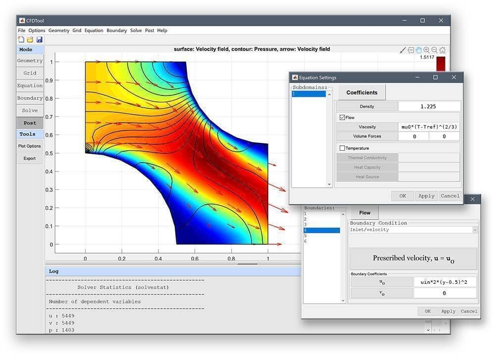

CFDTool - _CFD Simulation Made Easy_
====================================

About
-----

[**CFDTool**](https://www.cfdtool.com) is a
[<b>C</b>omputational <b>F</b>luid <b>D</b>ynamics (CFD)](https://en.wikipedia.org/wiki/Computational_fluid_dynamics)
<b>Tool</b>box for modeling and simulation of fluid flows with coupled
heat transfer.

Based on the [FEATool Multiphysics](https://www.featool.com)
simulation platform, _CFDTool_ is specifically designed to make fluid
dynamics and heat transfer simulations easy and fun.

Features
--------

The _CFDTool_ toolbox includes the following features:

- Completely stand-alone and self-contained toolbox
- Fully integrated and easy to use Graphical User Interface (GUI)
- Modeling and simulation in 1D, 2D, 3D, and axisymmetric coordinate systems
- Seamless [OpenFOAM GUI](https://www.featool.com/Easy-to-Use-OpenFOAM-GUI/) and
  [SU2](https://www.featool.com/doc/su2.html) CFD solver integrations
- Built-in geometry and CAD tools
- Automatic mesh and grid generation
- Pre-defined equations and boundary conditions:
  + Incompressible viscous fluid flows (Navier-Stokes equations)
  + Compressible inviscid flows (Euler equations)
  + Heat transfer (Convection and Conduction)
- Multiphysics support for fluid flow and thermal analysis
- Simulation of laminar and turbulent flows (Spalart-Allmaras,
  k-epsilon, and k-omega turbulence models available with OpenFOAM/SU2)
- Stationary and time-dependent analysis types
- Postprocessing and visualization

[System Requirements](https://www.featool.com/doc/quickstart.html#prereq)
-------------------

_CFDTool_ is a fully integrated simulation environment, which has been
tested and verified to work with 64-bit Windows, Linux, and MacOS
operating systems with a minimum of 4 GB RAM memory.

[Installation](https://www.featool.com/doc/quickstart.html#install)
------------

In order to use _CFDTool_, the software must first be installed on the
intended computer system. It is recommended to first uninstall
previous versions before installing/upgrading to a newer version.

Please follow the steps below to install _CFDTool_ as a stand-alone
app, or as a MATLAB® toolbox. The installers can be downloaded
directly from the
[CFDTool releases](https://github.com/precise-simulation/cfdtool/releases/latest)
and installed manually, or installed from the MATLAB® APPS and Add-On
Toolbar as a toolbox.

  

### Stand-Alone App Installation

Use the steps below to install the app in stand-alone mode

1) First download the installer for your operating system

    + [**CFDTool Windows Installer**](https://github.com/precise-simulation/cfdtool/releases/latest/download/CFDTool_install.exe)

    + [**CFDTool Linux Installer**](https://github.com/precise-simulation/cfdtool/releases/latest/download/CFDTool.install)

2) Save it to a directory and run the installer. This will first
download and/or install the application runtime if required (which may
require up to 10 GB space to install), and then the program file will
be extracted.

3) When everything has been installed, run the program file to start
_CFDTool_. Please be patient as the application runtime can take some
time to start.

### MATLAB® Toolbox Installation

Follow the steps below to install _FEATool_ as a MATLAB® toolbox, and
to enable running MATLAB® simulation m-scripts

1) Download the
   [CFDTool.mlappinstall](https://github.com/precise-simulation/cfdtool/releases/latest/download/CFDTool.mlappinstall)
   toolbox installation file.

2) Then start MATLAB®, press the **APPS** toolbar button,
   and select the **Install App** button.

3) When prompted to choose a toolbox file to install, select the
   **CFDTool.mlappinstall** file and press **OK**.

4) Press the **Install** button if prompted to _"Install to My Apps"_.

Once the toolbox has been installed, an app icon will be available in
the _APPS_ toolbar to start the _CFDTool_ GUI. (Note that MATLAB® may
not show or give any indication of the toolbox installation progress
or completion.)

[OpenFOAM® CFD Solver](https://featool.com/doc/openfoam.html)
--------------------

The optional OpenFOAM CFD solver integration makes it easy to perform
both laminar and turbulent high performance CFD simulations. OpenFOAM
CFD simulations often results in a magnitude or more speedup for
instationary simulations compared to the built-in flow
solvers. Additionally, with the multi-simulation solver integration in
_CFDTool_ it is possible to compare and better validate simulation
results obtained using both the built-in and OpenFOAM CFD solvers.

The OpenFOAM solver binaries are currently not included with _CFDTool_
and must be installed separately. The OpenFOAM solver integration has
been verified with OpenFOAM versions 2021 and 9. For Microsoft Windows
systems it is recommended to install and use the pre-compiled
Native-windows/mingw binaries available from
[OpenCFD ESI](https://develop.openfoam.com/Development/openfoam/-/wikis/precompiled/windows),
or the distribution from the
[OpenFOAM Foundation](https://openfoam.org/download)
for Linux and MacOS systems.

Basic Use
---------

_CFDTool_ and its GUI has been specifically designed to be as easy to
use as possible, and making learning CFD simulation by experimentation
easy.

The modeling process is divided into six different steps or modes

- **Geometry** - Definition of the geometry to be modeled
- **Grid** - Subdivision of the geometry into smaller cells suitable
  for computation
- **Equation** - Specification of material parameters and coefficients
- **Boundary** - Boundary conditions specify how the model interacts
  with the surrounding environment (outside the geometry)
- **Solve** - Solution and simulation of the defined model problem
- **Post** - Visualization and postprocessing

These modes can be accessed by clicking on the corresponding buttons
in left hand side _Mode_ toolbar. The different modes may have
specialized and different _Tools_ available in the corresponding
toolbar. Advanced mode options may also be available in the
corresponding menus.

A number of pre-defined fluid flow and heat transfer tutorial examples
are available under the **File** > **Model Examples and Tutorials...**
menu option.

Basic use and how to set up and model turbulent flow past a
backwards facing step with OpenFOAM is explained in the
[linked video tutorial](https://youtu.be/gHGttc31xj0)
(click on the image below to start the tutorial).

  

Documentation
-------------

The _FEATool_
[documentation](https://www.featool.com/doc),
which shares most functionality with _CFDTool_, is available online,
and also by selecting the corresponding option in the _Help_ menu of
the _CFDTool_ GUI.

License
-------

(C) Copyright 2013-2025 by Precise Simulation Limited.
All Rights Reserved.

CFDTool™ and FEATool Multiphysics™ are trademarks of Precise
Simulation Limited. MATLAB® is a registered trademark of The
MathWorks, Inc.  OPENFOAM® is a registered trade mark of OpenCFD
Limited. All other trademarks are the property of their respective
owners. Precise Simulation Ltd and its products are not affiliated
with, endorsed by, sponsored by these trademark owners.

The license agreement for using CFDTool™ is included with the
distribution and can also be accessed from the _Help_ menu in the
application.

Carefully read the license terms and conditions before installing or
using the programs or documentation. Installing or using the programs
means you have accepted and agree to be bound by the terms and
conditions of this agreement. if you do not accept them, uninstall,
remove and completely delete the programs and documentation.
